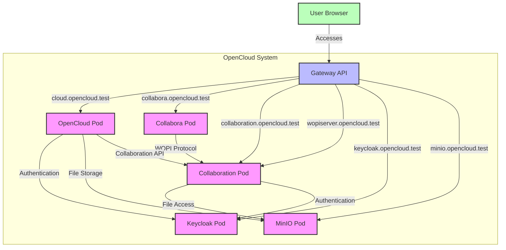

# OpenCloud Helm Charts

Welcome to the **OpenCloud Helm Charts** repository! This repository is intended as a community-driven space for developing and maintaining Helm charts for deploying OpenCloud on Kubernetes.

## 🚀 About

This repository is created to **welcome contributions from the community**. It does not contain official charts from OpenCloud GmbH and is **not officially supported by OpenCloud GmbH**. Instead, these charts are maintained by the open-source community.

## Introduction

OpenCloud is a cloud collaboration platform that provides file sync and share, document collaboration, and more. This Helm chart deploys OpenCloud with Keycloak for authentication, MinIO for object storage, and Collabora for document editing.

## Prerequisites

- Kubernetes 1.19+
- Helm 3.2.0+
- PV provisioner support in the underlying infrastructure (if persistence is enabled)
- External ingress controller (e.g., Cilium Gateway API) for routing traffic to the services

## 📦 Installing the Helm Charts

To install the chart with the release name `my-opencloud`:

```bash
helm install opencloud .
```

## Architecture

This Helm chart deploys the following components:

1. **OpenCloud** - Main application (fork of ownCloud Infinite Scale)
2. **Keycloak** - Authentication provider with OpenID Connect
3. **PostgreSQL** - Database for Keycloak
4. **MinIO** - S3-compatible object storage
5. **Collabora** - Online document editor (CODE - Collabora Online Development Edition)
6. **Collaboration Service** - WOPI server that connects OpenCloud with Collabora

All services are deployed with `ClusterIP` type, which means they are only accessible within the Kubernetes cluster. You need to configure your own ingress controller (e.g., Cilium Gateway API) to expose the services externally.

### Component Interaction Diagram

The following diagram shows how the different components interact with each other:



Key interactions:

1. **User to Gateway**: 
   - Users access all services through the Gateway API using different hostnames

2. **OpenCloud Pod**:
   - Main application that users interact with
   - Authenticates users via Keycloak
   - Stores files in MinIO
   - Communicates with Collaboration service for collaborative editing

3. **Collabora Pod**:
   - Office document editor
   - Connects to the Collaboration pod via WOPI protocol
   - Uses token server secret for authentication

4. **Collaboration Pod**:
   - Implements WOPI server functionality
   - Acts as intermediary between Collabora and file storage
   - Handles collaborative editing sessions
   - Accesses files from MinIO

5. **Keycloak Pod**:
   - Handles authentication for all services
   - Manages user identities and permissions

6. **MinIO Pod**:
   - Object storage for all files
   - Accessed by OpenCloud and Collaboration pods

## Configuration

The following table lists the configurable parameters of the OpenCloud chart and their default values.

### Global Settings

| Parameter | Description | Default |
| --------- | ----------- | ------- |
| `namespace` | Namespace to install the chart into | `opencloud` |
| `global.domain.opencloud` | Domain for OpenCloud | `cloud.opencloud.test` |
| `global.domain.keycloak` | Domain for Keycloak | `keycloak.opencloud.test` |
| `global.domain.minio` | Domain for MinIO | `minio.opencloud.test` |
| `global.domain.collabora` | Domain for Collabora | `collabora.opencloud.test` |
| `global.domain.onlyoffice` | Domain for OnlyOffice | `onlyoffice.opencloud.test` |
| `global.domain.companion` | Domain for Companion | `companion.opencloud.test` |
| `global.tls.enabled` | Enable TLS | `true` |
| `global.tls.selfSigned` | Use self-signed certificates | `true` |
| `global.tls.acmeEmail` | ACME email for Let's Encrypt | `example@example.org` |
| `global.tls.acmeCAServer` | ACME CA server | `https://acme-v02.api.letsencrypt.org/directory` |
| `global.storage.storageClass` | Storage class for persistent volumes | `""` |

### Image Settings

| Parameter | Description | Default |
| --------- | ----------- | ------- |
| `image.repository` | OpenCloud image repository | `opencloudeu/opencloud-rolling` |
| `image.tag` | OpenCloud image tag | `latest` |
| `image.pullPolicy` | Image pull policy | `IfNotPresent` |
| `image.pullSecrets` | Image pull secrets | `[]` |

### OpenCloud Settings

| Parameter | Description | Default |
| --------- | ----------- | ------- |
| `opencloud.enabled` | Enable OpenCloud | `true` |
| `opencloud.replicas` | Number of replicas (Note: When using multiple replicas, persistence should be disabled or use a storage class that supports ReadWriteMany access mode) | `1` |
| `opencloud.logLevel` | Log level | `info` |
| `opencloud.logColor` | Enable log color | `false` |
| `opencloud.logPretty` | Enable pretty logging | `false` |
| `opencloud.insecure` | Insecure mode (for self-signed certificates) | `true` |
| `opencloud.enableBasicAuth` | Enable basic auth | `false` |
| `opencloud.adminPassword` | Admin password | `admin` |
| `opencloud.createDemoUsers` | Create demo users | `false` |
| `opencloud.resources` | CPU/Memory resource requests/limits | `{}` |
| `opencloud.persistence.enabled` | Enable persistence | `true` |
| `opencloud.persistence.size` | Size of the persistent volume | `10Gi` |
| `opencloud.persistence.storageClass` | Storage class | `""` |
| `opencloud.persistence.accessMode` | Access mode | `ReadWriteOnce` |
| `opencloud.storage.driver` | Storage driver (posix, decomposed, decomposeds3) | `decomposeds3` |
| `opencloud.storage.systemDriver` | System storage driver (posix, decomposed) | `decomposed` |
| `opencloud.storage.s3.endpoint` | S3 endpoint (defaults to MinIO service if empty) | `""` |
| `opencloud.storage.s3.region` | S3 region | `default` |
| `opencloud.storage.s3.accessKey` | S3 access key (defaults to MinIO root user if empty) | `""` |
| `opencloud.storage.s3.secretKey` | S3 secret key (defaults to MinIO root password if empty) | `""` |
| `opencloud.storage.s3.bucket` | S3 bucket (defaults to MinIO bucket name if empty) | `""` |
| `opencloud.storage.s3.createBucket` | Create bucket if it doesn't exist | `true` |

### Keycloak Settings

| Parameter | Description | Default |
| --------- | ----------- | ------- |
| `keycloak.enabled` | Enable Keycloak | `true` |
| `keycloak.replicas` | Number of replicas | `1` |
| `keycloak.adminUser` | Admin user | `admin` |
| `keycloak.adminPassword` | Admin password | `admin` |
| `keycloak.resources` | CPU/Memory resource requests/limits | `{}` |
| `keycloak.realm` | Realm name | `openCloud` |
| `keycloak.persistence.enabled` | Enable persistence | `true` |
| `keycloak.persistence.size` | Size of the persistent volume | `1Gi` |
| `keycloak.persistence.storageClass` | Storage class | `""` |
| `keycloak.persistence.accessMode` | Access mode | `ReadWriteOnce` |

### PostgreSQL Settings

| Parameter | Description | Default |
| --------- | ----------- | ------- |
| `postgres.enabled` | Enable PostgreSQL | `true` |
| `postgres.database` | Database name | `keycloak` |
| `postgres.user` | Database user | `keycloak` |
| `postgres.password` | Database password | `keycloak` |
| `postgres.resources` | CPU/Memory resource requests/limits | `{}` |
| `postgres.persistence.enabled` | Enable persistence | `true` |
| `postgres.persistence.size` | Size of the persistent volume | `1Gi` |
| `postgres.persistence.storageClass` | Storage class | `""` |
| `postgres.persistence.accessMode` | Access mode | `ReadWriteOnce` |

### MinIO Settings

| Parameter | Description | Default |
| --------- | ----------- | ------- |
| `minio.enabled` | Enable MinIO | `true` |
| `minio.rootUser` | Root user | `opencloud` |
| `minio.rootPassword` | Root password | `opencloud-secret-key` |
| `minio.bucketName` | Bucket name | `opencloud-bucket` |
| `minio.resources` | CPU/Memory resource requests/limits | `{}` |
| `minio.persistence.enabled` | Enable persistence | `true` |
| `minio.persistence.size` | Size of the persistent volume | `10Gi` |
| `minio.persistence.storageClass` | Storage class | `""` |
| `minio.persistence.accessMode` | Access mode | `ReadWriteOnce` |

### Collabora Settings

| Parameter | Description | Default |
| --------- | ----------- | ------- |
| `collabora.enabled` | Enable Collabora | `true` |
| `collabora.repository` | Collabora image repository | `collabora/code` |
| `collabora.tag` | Collabora image tag | `24.04.13.2.1` |
| `collabora.pullPolicy` | Image pull policy | `IfNotPresent` |
| `collabora.adminUser` | Admin user | `admin` |
| `collabora.adminPassword` | Admin password | `admin` |
| `collabora.ssl.enabled` | Enable SSL | `true` |
| `collabora.ssl.verification` | SSL verification | `true` |
| `collabora.resources` | CPU/Memory resource requests/limits | `{}` |

### Collaboration Service Settings

| Parameter | Description | Default |
| --------- | ----------- | ------- |
| `collaboration.enabled` | Enable collaboration service | `true` |
| `collaboration.wopiDomain` | WOPI server domain | `collaboration.opencloud.test` |
| `collaboration.resources` | CPU/Memory resource requests/limits | `{}` |

## Cilium Gateway API Configuration

This chart includes Cilium HTTPRoute resources that can be used to expose the OpenCloud, Keycloak, and MinIO services externally. The HTTPRoutes are configured to route traffic to the respective services.

### Cilium HTTPRoute Settings

| Parameter | Description | Default |
| --------- | ----------- | ------- |
| `cilium.httproute.enabled` | Enable Cilium HTTPRoutes | `true` |
| `cilium.httproute.gateway.name` | Gateway name | `cilium-gateway` |
| `cilium.httproute.gateway.namespace` | Gateway namespace | `""` (defaults to Release.Namespace) |

The following HTTPRoutes are created when `cilium.httproute.enabled` is set to `true`:

1. **OpenCloud HTTPRoute**:
   - Hostname: `global.domain.opencloud`
   - Service: `{{ release-name }}-opencloud`
   - Port: 9200

2. **Keycloak HTTPRoute** (when `keycloak.enabled` is `true`):
   - Hostname: `global.domain.keycloak`
   - Service: `{{ release-name }}-keycloak`
   - Port: 8080

3. **MinIO HTTPRoute** (when `minio.enabled` is `true`):
   - Hostname: `global.domain.minio`
   - Service: `{{ release-name }}-minio`
   - Port: 9001

   default user: opencloud
   pass: opencloud-secret-key

4. **Collabora HTTPRoute** (when `collabora.enabled` is `true`):
   - Hostname: `global.domain.collabora`
   - Service: `{{ release-name }}-collabora`
   - Port: 9980

5. **Collaboration (WOPI) HTTPRoute** (when `collaboration.enabled` is `true`):
   - Hostname: `collaboration.wopiDomain`
   - Service: `{{ release-name }}-collaboration`
   - Port: 9300

All HTTPRoutes are configured to use the same Gateway specified by `cilium.httproute.gateway.name` and `cilium.httproute.gateway.namespace`.

## Setting Up Gateway API with Talos, Cilium, and cert-manager

This section provides a practical guide to setting up the Gateway API with Talos, Cilium, and cert-manager for OpenCloud.

### Prerequisites

- Talos Kubernetes cluster up and running
- kubectl configured to access your cluster
- Helm 3 installed

### Step 1: Install Cilium with Gateway API Support

First, install Cilium with Gateway API support using Helm:

```bash
# Add the Cilium Helm repository
helm repo add cilium https://helm.cilium.io/

# Install Cilium with Gateway API enabled
helm install cilium cilium/cilium \
  --namespace kube-system \
  --set gatewayAPI.enabled=true \
  --set kubeProxyReplacement=strict \
  --set k8sServiceHost=<your-kubernetes-api-server-ip> \
  --set k8sServicePort=6443
```

### Step 2: Install cert-manager

Install cert-manager to manage TLS certificates:

```bash
# Add the Jetstack Helm repository
helm repo add jetstack https://charts.jetstack.io

# Install cert-manager
helm install cert-manager jetstack/cert-manager \
  --namespace cert-manager \
  --create-namespace \
  --set installCRDs=true
```

### Step 3: Create a ClusterIssuer for cert-manager

Create a ClusterIssuer for cert-manager to issue certificates:

```yaml
# cluster-issuer.yaml
apiVersion: cert-manager.io/v1
kind: ClusterIssuer
metadata:
  name: selfsigned-issuer
spec:
  selfSigned: {}
```

Apply the ClusterIssuer:

```bash
kubectl apply -f cluster-issuer.yaml
```

### Step 4: Create the Gateway

Create a Gateway resource to expose your services:

```yaml
# gateway.yaml
apiVersion: gateway.networking.k8s.io/v1beta1
kind: Gateway
metadata:
  name: cilium-gateway
  namespace: kube-system
spec:
  gatewayClassName: cilium
  infrastructure:
    annotations:
      io.cilium/lb-ipam-ips: "192.168.178.77"  # Replace with your desired IP
      cilium.io/hubble-visibility: "flow"
      cilium.io/preserve-client-cookies: "true"
      cilium.io/preserve-csrf-token: "true"
  addresses:
    - type: IPAddress
      value: 192.168.178.77  # Replace with your desired IP
  listeners:
    - name: opencloud-https
      protocol: HTTPS
      port: 443
      hostname: "cloud.opencloud.test"
      tls:
        mode: Terminate
        certificateRefs:
          - name: opencloud-tls
            namespace: kube-system
      allowedRoutes:
        namespaces:
          from: All
    - name: keycloak-https
      protocol: HTTPS
      port: 443
      hostname: "keycloak.opencloud.test"
      tls:
        mode: Terminate
        certificateRefs:
          - name: keycloak-tls
            namespace: kube-system
      allowedRoutes:
        namespaces:
          from: All
    - name: minio-https
      protocol: HTTPS
      port: 443
      hostname: "minio.opencloud.test"
      tls:
        mode: Terminate
        certificateRefs:
          - name: minio-tls
            namespace: kube-system
      allowedRoutes:
        namespaces:
          from: All
    - name: collabora-https
      protocol: HTTPS
      port: 443
      hostname: "collabora.opencloud.test"
      tls:
        mode: Terminate
        certificateRefs:
          - name: collabora-tls
            namespace: kube-system
      allowedRoutes:
        namespaces:
          from: All
    - name: collaboration-https
      protocol: HTTPS
      port: 443
      hostname: "collaboration.opencloud.test"
      tls:
        mode: Terminate
        certificateRefs:
          - name: collaboration-tls
            namespace: kube-system
      allowedRoutes:
        namespaces:
          from: All
    - name: wopi-https
      protocol: HTTPS
      port: 443
      hostname: "wopiserver.opencloud.test"
      tls:
        mode: Terminate
        certificateRefs:
          - name: wopi-tls
            namespace: kube-system
      allowedRoutes:
        namespaces:
          from: All
```

Apply the Gateway:

```bash
kubectl apply -f gateway.yaml
```

### Step 5: Configure DNS

Configure your DNS to point to the Gateway IP address. You can use a wildcard DNS record or individual records for each service:

```
*.opencloud.test  IN  A  192.168.178.77  # Replace with your Gateway IP
```

Alternatively, for local testing, you can add entries to your `/etc/hosts` file:

```
192.168.178.77  cloud.opencloud.test
192.168.178.77  keycloak.opencloud.test
192.168.178.77  minio.opencloud.test
192.168.178.77  collabora.opencloud.test
192.168.178.77  collaboration.opencloud.test
192.168.178.77  wopiserver.opencloud.test
```

### Step 6: Install OpenCloud

Finally, install OpenCloud using Helm:

```bash
# Clone the repository
git clone https://github.com/your-repo/opencloud-helm.git
cd opencloud-helm

# Install OpenCloud
helm install opencloud . \
  --namespace opencloud \
  --create-namespace \
  --set cilium.httproute.gateway.name=cilium-gateway \
  --set cilium.httproute.gateway.namespace=kube-system
```

### Troubleshooting

If you encounter issues with the Collabora pod connecting to the WOPI server, ensure that:

1. The WOPI server certificate is properly created in the kube-system namespace
2. The Collabora pod is configured with the correct WOPI token server secret
3. The Gateway is properly configured to route traffic to the WOPI server

You can check the status of the certificates:

```bash
kubectl get certificates -n kube-system
```

And check the logs of the Collabora pod:

```bash
kubectl logs -n opencloud -l app.kubernetes.io/component=collabora
```

## 💡 Contributing

We encourage contributions from the community! If you'd like to contribute:
- Fork this repository
- Submit a Pull Request
- Discuss and collaborate on issues

Please ensure that your PR follows best practices and includes necessary documentation.

## 📜 License

This project is licensed under the **AGPLv3** licence. See the [LICENSE](LICENSE) file for more details.

## Community Maintained

This repository is **community-maintained** and **not officially supported by OpenCloud GmbH**. Use at your own risk, and feel free to contribute to improve the project!
