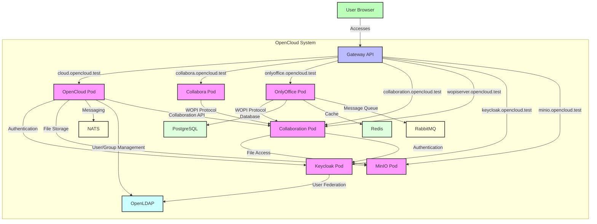

# OpenCloud Helm Charts

Welcome to the **OpenCloud Helm Charts** repository! This repository is intended as a community-driven space for developing and maintaining Helm charts for deploying OpenCloud on Kubernetes.

## ⚠️ IMPORTANT: Architectural Considerations

This chart implements a **pod-per-service architecture** where each OpenCloud service runs in its own Kubernetes pod. 


### Problems with Pod-Per-Service:
1. **Service Discovery Complexity**: Requires complex service mesh configuration
2. **Resource Overhead**: Each pod needs its own container runtime overhead
3. **Debugging Complexity**: Issues become harder to trace across multiple pods
4. **Unnecessary Separation**: Most services don't need isolation

### Recommended Approach:
The standard `opencloud` chart (found in `charts/opencloud`) groups services intelligently:
- Frontend services (web, graph, ocdav, ocs) in one pod
- Backend services (postprocessing, eventhistory) in another pod
- Only security-critical services (antivirus, thumbnails, tika) isolated

## When to Use This Chart

Only consider this chart if you:
- ✅ Have specific regulatory requirements for service isolation
- ✅ Need fine-grained resource limits per service
- ✅ Have expertise in Kubernetes service mesh debugging
- ✅ Accept higher resource usage and complexity
- ✅ Are prepared for NATS HA setup

Otherwise, use the standard `opencloud` chart (found in `charts/opencloud`).

## Scaling Limitations

The following services CANNOT be scaled beyond 1 replica:

| Service | Reason | Tracking Issue |
|---------|--------|----------------|
| IDM | Embedded LDAP doesn't support replication | |
| IDP | Depends on IDM | |
| Search | Uses BoltDB (single-writer database) | |
| OCM | Federation service state |  |
| NATS | Embedded NATS (use external for HA) |  |

## 📑 Table of Contents

- [About](#-about)
- [Community](#-community)
- [Contributing](#-contributing)
- [Prerequisites](#prerequisites)
- [Available Charts](#-available-charts)
  - [Production Chart](#production-chart-chartsopencloud)
  - [Development Chart](#development-chart-chartsopencloud-dev)
- [Installation](#-installation)
  - [Installing from Git Repository](#installing-from-git-repository)
  - [Installing from OCI Registry](#installing-from-oci-registry)
- [Architecture](#architecture)
  - [Component Interaction Diagram](#component-interaction-diagram)
- [Configuration](#configuration)
  - [Global Settings](#global-settings)
  - [Image Settings](#image-settings)
  - [OpenCloud Settings](#opencloud-settings)
  - [Keycloak Settings](#keycloak-settings)
  - [PostgreSQL Settings](#postgresql-settings)
  - [OnlyOffice Settings](#onlyoffice-settings)
  - [Collabora Settings](#collabora-settings)
  - [Collaboration Service Settings](#collaboration-service-settings)
- [Gateway API Configuration](#gateway-api-configuration)
  - [HTTPRoute Settings](#httproute-settings)
- [Setting Up Gateway API with Talos, Cilium, and cert-manager](#setting-up-gateway-api-with-talos-cilium-and-cert-manager)
- [Setting up Ingress](#setting-up-ingress)
- [License](#-license)
- [Community Maintained](#community-maintained)

## 🚀 About

This repository is created to **welcome contributions from the community**. It does not contain official charts from OpenCloud GmbH and is **not officially supported by OpenCloud GmbH**. Instead, these charts are maintained by the open-source community.

OpenCloud is a cloud collaboration platform that provides file sync and share, document collaboration, and more. This Helm chart deploys OpenCloud with Keycloak for authentication, MinIO for object storage, and multiple options for document editing including Collabora and OnlyOffice.

## 💬 Community

Join our Matrix chat for discussions about OpenCloud Helm Charts:
- [OpenCloud Helm on Matrix](https://matrix.to/#/%23opencloud-helm:matrix.org)

For general OpenCloud discussions:
- [OpenCloud on Matrix](https://matrix.to/#/%23opencloud:matrix.org)
- [OpenCloud on Mastodon](https://social.opencloud.eu/@OpenCloud)
- [GitHub Discussions](https://github.com/orgs/opencloud-eu/discussions)

## 💡 Contributing

We encourage contributions from the community! This repository follows a community-driven development model with defined roles and responsibilities.

For detailed contribution guidelines, please see our [CONTRIBUTING.md](./CONTRIBUTING.md) document.

This includes:
- How to submit contributions
- Our community governance model
- How to become a reviewer or maintainer

The current maintainers and reviewers are listed in [MAINTAINERS.md](./MAINTAINERS.md).

## Prerequisites

- Kubernetes 1.19+ (e.g. Talos Kubernetes, RKE2)
- Helm 3.2.0+ or Timoni Bundle with FluxCD (flux-helm-release)
- PVC provisioner support in the underlying infrastructure (if persistence is enabled)
- External ingress controller (e.g., Cilium Gateway API) for routing traffic to the services

## ⚠️ Version Stability Notice

**Important**: These Helm charts are currently at version `0.x.x`, which according to [Semantic Versioning 2.0](https://semver.org/spec/v2.0.0.html#spec-item-4) means:
- The charts are still under heavy development
- Breaking changes may occur at any time
- The public API should not be considered stable
- Use with caution in production environments

We recommend pinning to specific chart versions and thoroughly testing updates before applying them.

## 📦 Available Charts

This repository contains the following chart:

### Microservices Chart (`charts/opencloud-microservices`)

**Architecture**: Pod-per-service
- Every single service in its own pod
- Full Gateway API integration
- NATS service discovery required
- Keycloak for authentication
- MinIO for object storage
- Integrated LDAP 
- Document editing with Collabora and/or OnlyOffice
- Slightly higher resource usage due to microservices pod overhead
### Microservices Chart (`charts/opencloud-microservices`)

**Architecture**: Pod-per-service
- Every single service in its own pod
- Full Gateway API integration
- NATS service discovery required
- Keycloak for authentication
- MinIO for object storage
- Integrated LDAP 
- Document editing with Collabora and/or OnlyOffice
- Slightly higher resource usage due to microservices pod overhead
- See [architectural warnings](./charts/opencloud-microservices/README.md#architectural-considerations)


## 🚀 Installation

You can install the Helm charts either directly from this Git repository or from the OCI registry.

### Installing from Git Repository

```bash
# Clone the repository
git clone https://github.com/opencloud-eu/helm.git

# Install Microservice Chart
cd charts/opencloud-microservices/deployments/helm
helmfile sync
```
You can also install it with timoni and fluxcd instead of helm:
```bash
kubectl apply -f ./charts/opencloud-microservices/deployments/timoni/ && \
timoni bundle apply -f ./charts/opencloud-microservices/deployments/timoni/opencloud.cue --runtime ./charts/opencloud-microservices/deployments/timoni/runtime.cue
```


### Installing from OCI Registry

The charts are also available in the GitHub Container Registry (GHCR) as OCI artifacts:

```bash
cd charts/opencloud-microservices/deployments
helmfile sync

```
You can also install it with timoni instead of helm:
```bash
kubectl apply -f ./charts/opencloud-microservices/deployments/timoni/ && \
timoni bundle apply -f ./charts/opencloud-microservices/deployments/timoni/opencloud.cue --runtime ./charts/opencloud-microservices/deployments/timoni/runtime.cue
```


## Architecture

The microservices chart (`charts/opencloud-microservices`) deploys each OpenCloud service in its own pod with the following components:

1. **OpenCloud Services** - Each service (web, graph, ocdav, ocs, storageusers, storagesystem, etc.) runs in its own pod
2. **Keycloak** - Authentication provider with OpenID Connect
3. **PostgreSQL** - Database for Keycloak
4. **MinIO** - S3-compatible object storage
5. **NATS** - Messaging system for service discovery and communication
6. **Collabora** - Online document editor (CODE - Collabora Online Development Edition)
7. **OnlyOffice** - Alternative document editor with real-time collaboration
8. **Collaboration Service** - WOPI server that connects OpenCloud with document editors
9. **Redis** - Cache for OnlyOffice
10. **RabbitMQ** - Message queue for OnlyOffice
11. **LDAP** - LDAP for auth
12. **IDM** - Integrated LDAP service

All services are deployed with `ClusterIP` type, which means they are only accessible within the Kubernetes cluster. You need to configure your own ingress controller (e.g., Cilium Gateway API) to expose the services externally.

### Component Interaction Diagram

The following diagram shows how the different components interact with each other:



Key interactions:

1. **User to Gateway**: 
   - Users access all services through the Gateway API using different hostnames

2. **OpenCloud Pod**:
   - Main application that users interact with
   - Authenticates users via Keycloak
   - Stores files in MinIO
   - Communicates with Collaboration service for collaborative editing

3. **Collabora Pod**:
   - Office document editor
   - Connects to the Collaboration pod via WOPI protocol
   - Uses token server secret for authentication

4. **OnlyOffice Pod**:
   - Alternative office document editor
   - Connects to the Collaboration pod via WOPI protocol
   - Uses PostgreSQL for database storage
   - Uses Redis for caching
   - Uses RabbitMQ for message queuing
   - Provides real-time collaborative editing

5. **Collaboration Pod**:
   - Implements WOPI server functionality
   - Acts as intermediary between document editors and file storage
   - Handles collaborative editing sessions
   - Accesses files from MinIO

6. **Keycloak Pod**:
   - Handles authentication for all services
   - Manages user identities and permissions

7. **MinIO Pod**:
   - Object storage for all files
   - Accessed by OpenCloud and Collaboration pods

## Configuration

The following sections outline the main configuration parameters for the microservices chart (`charts/opencloud-microservices`). For a complete list of configuration options, please refer to the [values.yaml](./values.yaml) file.

### Global Settings

| Parameter | Description | Default |
| --------- | ----------- | ------- |
| `image.repository` | OpenCloud image repository | `opencloudeu/opencloud-rolling` |
| `image.tag` | OpenCloud image tag | `""` (uses chart appVersion) |
| `image.pullPolicy` | Image pull policy | `IfNotPresent` |
| `image.pullSecrets` | Image pull secrets | `[]` |
| `image.sha` | Image sha / digest | `""` |
| `initContainerImage.repository` | Init container image repository | `busybox` |
| `initContainerImage.tag` | Init container image tag | `stable` |
| `initContainerImage.pullPolicy` | Init container pull policy | `IfNotPresent` |
| `initContainerImage.sha` | Init container image sha / digest | `""` |

### Logging Settings

| Parameter | Description | Default |
| --------- | ----------- | ------- |
| `logging.level` | Log level (panic, fatal, error, warn, info, debug, trace) | `info` |
| `logging.pretty` | Enable pretty log output | `false` |
| `logging.color` | Enable colorized log output | `false` |

### Tracing Settings

| Parameter | Description | Default |
| --------- | ----------- | ------- |
| `tracing.enabled` | Enable tracing | `false` |
| `tracing.type` | Trace provider type | `jaeger` |
| `tracing.endpoint` | Tracing system endpoint | `""` |
| `tracing.collector` | HTTP endpoint for sending spans | `""` |

### HTTP Settings

| Parameter | Description | Default |
| --------- | ----------- | ------- |
| `http.cors.allow_origins` | List of allowed CORS origins | `[]` |
| `http.csp.directives.childSrc` | CSP child-src directive values | `["'self'"]` |
| `http.csp.directives.connectSrc` | CSP connect-src directive values | `["'self'", "blob:", "https://${COMPANION_DOMAIN|companion.opencloud.test}/", "wss://${COMPANION_DOMAIN|companion.opencloud.test}/", "https://raw.githubusercontent.com/opencloud-eu/awesome-apps/", "https://${KEYCLOAK_DOMAIN|keycloak.opencloud.test}/"]` |
| `http.csp.directives.defaultSrc` | CSP default-src directive values | `["'none'"]` |
| `http.csp.directives.fontSrc` | CSP font-src directive values | `["'self'"]` |
| `http.csp.directives.frameAncestors` | CSP frame-ancestors directive values | `["'self'"]` |
| `http.csp.directives.frameSrc` | CSP frame-src directive values | `["'self'", "blob:", "https://${ONLYOFFICE_DOMAIN|onlyoffice.opencloud.test}/", "https://${COLLABORA_DOMAIN|collabora.opencloud.test}/"]` |
| `http.csp.directives.imgSrc` | CSP img-src directive values | `["'self'", "data:", "blob:", "https://${ONLYOFFICE_DOMAIN|onlyoffice.opencloud.test}/", "https://${COLLABORA_DOMAIN|collabora.opencloud.test}/"]` |
| `http.csp.directives.manifestSrc` | CSP manifest-src directive values | `["'self'"]` |
| `http.csp.directives.mediaSrc` | CSP media-src directive values | `["'self'"]` |
| `http.csp.directives.objectSrc` | CSP object-src directive values | `["'self'", "blob:"]` |
| `http.csp.directives.scriptSrc` | CSP script-src directive values | `["'self'", "'unsafe-inline'", "blob:", "https://${ONLYOFFICE_DOMAIN|onlyoffice.opencloud.test}/", "https://${COLLABORA_DOMAIN|collabora.opencloud.test}/"]` |
| `http.csp.directives.styleSrc` | CSP style-src directive values | `["'self'", "'unsafe-inline'", "https://${ONLYOFFICE_DOMAIN|onlyoffice.opencloud.test}/", "https://${COLLABORA_DOMAIN|collabora.opencloud.test}/"]` |
| `http.csp.directives.workerSrc` | CSP worker-src directive values | `["'self'", "blob:"]` |

### Keycloak Settings

| Parameter | Description | Default |
| --------- | ----------- | ------- |
| `keycloak.enabled` | Enable Keycloak | `true` |
| `keycloak.domain` | Keycloak domain | `keycloak.opencloud.test` |
| `keycloak.roleAssignmentDriver` | OIDC role assignment driver | `oidc` |
| `keycloak.oidcIssuer` | OIDC issuer URL | `""` |
| `keycloak.webOidcClientId` | Web OIDC client ID | `web` |
| `keycloak.adminUserId` | Admin user ID | `""` |
| `keycloak.roleAssignmentOidcClaim` | OIDC role assignment claim | `roles` |
| `keycloak.webOidcMetadataUrl` | Web OIDC metadata URL | `""` |
| `keycloak.webOidcScope` | Web OIDC scope | `openid profile email groups` |
| `keycloak.image.registry` | Keycloak image registry | `quay.io` |
| `keycloak.image.repository` | Keycloak image repository | `keycloak/keycloak` |
| `keycloak.image.tag` | Keycloak image tag | `25.0.0` |
| `keycloak.postgresql.host` | PostgreSQL host | `keycloak-postgresql` |
| `keycloak.postgresql.port` | PostgreSQL port | `5432` |
| `keycloak.postgresql.database` | PostgreSQL database | `keycloak` |
| `keycloak.postgresql.username` | PostgreSQL username | `keycloak` |
| `keycloak.postgresql.password` | PostgreSQL password | `keycloak` |
| `keycloak.postgresql.version` | PostgreSQL version | `14` |
| `keycloak.config.adminUser` | Keycloak admin username | `admin` |
| `keycloak.config.adminPassword` | Keycloak admin password | `admin` |
| `keycloak.config.realm` | Keycloak realm | `openCloud` |
| `keycloak.config.clientId` | Keycloak client ID | `web` |

### MinIO Settings

| Parameter | Description | Default |
| --------- | ----------- | ------- |
| `minio.enabled` | Enable MinIO | `true` |
| `minio.domain` | MinIO domain | `minio.opencloud.test` |
| `minio.version` | MinIO chart version | `5.4.0` |
| `minio.image.registry` | MinIO image registry | `docker.io` |
| `minio.image.repository` | MinIO image repository | `minio/minio` |
| `minio.image.tag` | MinIO image tag | `latest` |
| `minio.config.mode` | MinIO mode (standalone or distributed) | `

### MinIO Settings

| Parameter | Description | Default |
| --------- | ----------- | ------- |
| `minio.enabled` | Enable MinIO | `true` |
| `minio.domain` | MinIO domain | `minio.opencloud.test` |
| `minio.version` | MinIO chart version | `5.4.0` |
| `minio.image.registry` | MinIO image registry | `docker.io` |
| `minio.image.repository` | MinIO image repository | `minio/minio` |
| `minio.image.tag` | MinIO image tag | `latest` |
| `minio.config.mode` | MinIO mode (standalone or distributed) | `standalone` |
| `minio.config.rootUser` | MinIO root user | `opencloud` |
| `minio.config.rootPassword` | MinIO root password | `opencloud-secret-key` |
| `minio.persistence.enabled` | Enable persistence | `true` |
| `minio.persistence.size` | Size of the persistent volume | `10Gi` |
| `minio.persistence.storageClass` | Storage class | `""` |
| `minio.resources` | CPU/Memory resource requests/limits | `{}` |

### Tika Settings

| Parameter | Description | Default |
| --------- | ----------- | ------- |
| `tika.enabled` | Enable Tika | `true` |
| `tika.replicas` | Number of replicas | `1` |
| `tika.image.repository` | Tika image repository | `apache/tika` |
| `tika.image.tag` | Tika image tag | `2.9.2.1` |
| `tika.image.pullPolicy` | Image pull policy | `IfNotPresent` |
| `tika.resources` | CPU/Memory resource requests/limits | `{}` |

### NATS Settings

| Parameter | Description | Default |
| --------- | ----------- | ------- |
| `nats.enabled` | Enable NATS | `true` |
| `nats.replicas` | Number of replicas | `1` |
| `nats.image.repository` | NATS image repository | `nats` |
| `nats.image.tag` | NATS image tag | `2.10.18-alpine` |
| `nats.image.pullPolicy` | Image pull policy | `IfNotPresent` |
| `nats.resources` | CPU/Memory resource requests/limits | `{}` |

### Individual Service Settings

Each OpenCloud service can be individually configured. The following parameters apply to most services:

| Parameter | Description | Default |
| --------- | ----------- | ------- |
| `<service>.enabled` | Enable the service | varies by service |
| `<service>.replicas` | Number of replicas | `1` |
| `<service>.image.repository` | Service image repository | uses global image |
| `<service>.image.tag` | Service image tag | uses global image |
| `<service>.image.pullPolicy` | Service image pull policy | uses global image |
| `<service>.resources` | CPU/Memory resource requests/limits | `{}` |
| `<service>.nodeSelector` | Node selector for pod placement | `{}` |
| `<service>.tolerations` | Tolerations for pod placement | `[]` |
| `<service>.affinity` | Affinity rules for pod placement | `{}` |
| `<service>.podAnnotations` | Annotations for pods | `{}` |
| `<service>.podLabels` | Labels for pods | `{}` |
| `<service>.persistence.enabled` | Enable persistence | `false` |
| `<service>.persistence.size` | Size of persistent volume | `1Gi` |
| `<service>.persistence.storageClass` | Storage class | `""` |
| `<service>.persistence.accessMode` | Access mode | `ReadWriteOnce` |

#### Activitylog Service
| Parameter | Description | Default |
| --------- | ----------- | ------- |
| `activitylog.enabled` | Enable activitylog service | `true` |
| `activitylog.replicas` | Number of replicas | `1` |

#### Antivirus Service
| Parameter | Description | Default |
| --------- | ----------- | ------- |
| `antivirus.enabled` | Enable antivirus service | `true` |
| `antivirus.replicas` | Number of replicas | `1` |

#### Appregistry Service
| Parameter | Description | Default |
| --------- | ----------- | ------- |
| `appregistry.enabled` | Enable appregistry service | `true` |
| `appregistry.replicas` | Number of replicas | `1` |

#### Audit Service
| Parameter | Description | Default |
| --------- | ----------- | ------- |
| `audit.enabled` | Enable audit service | `true` |
| `audit.replicas` | Number of replicas | `1` |

#### Auth-app Service
| Parameter | Description | Default |
| --------- | ----------- | ------- |
| `authapp.enabled` | Enable auth-app service | `true` |
| `authapp.replicas` | Number of replicas | `1` |

#### Auth-machine Service
| Parameter | Description | Default |
| --------- | ----------- | ------- |
| `authmachine.enabled` | Enable auth-machine service | `true` |
| `authmachine.replicas` | Number of replicas | `1` |

#### Auth-service Service
| Parameter | Description | Default |
| --------- | ----------- | ------- |
| `authservice.enabled` | Enable auth-service | `true` |
| `authservice.replicas` | Number of replicas | `1` |

#### Clientlog Service
| Parameter | Description | Default |
| --------- | ----------- | ------- |
| `clientlog.enabled` | Enable clientlog service | `true` |
| `clientlog.replicas` | Number of replicas | `1` |

#### Collabora Service
| Parameter | Description | Default |
| --------- | ----------- | ------- |
| `collabora.enabled` | Enable Collabora | `true` |
| `collabora.replicas` | Number of replicas | `1` |
| `collabora.image.repository` | Collabora image repository | `collabora/code` |
| `collabora.image.tag` | Collabora image tag | `24.04.13.2.1` |
| `collabora.image.pullPolicy` | Image pull policy | `IfNotPresent` |
| `collabora.config.username` | Admin username | `admin` |
| `collabora.config.password` | Admin password | `admin` |
| `collabora.config.server_name` | Server name | `collaboration.opencloud.test` |
| `collabora.config.dictionaries` | Enabled dictionaries | `de_DE en_GB en_US es_ES fr_FR it nl pt_BR pt_PT ru` |
| `collabora.config.extra_params` | Extra configuration parameters | `""` |

#### Collaboration Service
| Parameter | Description | Default |
| --------- | ----------- | ------- |
| `collaboration.enabled` | Enable collaboration service | `true` |
| `collaboration.replicas` | Number of replicas | `1` |
| `collaboration.wopiDomain` | WOPI server domain | `collaboration.opencloud.test` |

#### Eventhistory Service
| Parameter | Description | Default |
| --------- | ----------- | ------- |
| `eventhistory.enabled` | Enable eventhistory service | `true` |
| `eventhistory.replicas` | Number of replicas | `1` |

#### Frontend Service
| Parameter | Description | Default |
| --------- | ----------- | ------- |
| `frontend.enabled` | Enable frontend service | `true` |
| `frontend.replicas` | Number of replicas | `1` |

#### Graph Service
| Parameter | Description | Default |
| --------- | ----------- | ------- |
| `graph.enabled` | Enable graph service | `true` |
| `graph.replicas` | Number of replicas | `1` |

#### Groups Service
| Parameter | Description | Default |
| --------- | ----------- | ------- |
| `groups.enabled` | Enable groups service | `true` |
| `groups.replicas` | Number of replicas | `1` |

#### IDM Service
| Parameter | Description | Default |
| --------- | ----------- | ------- |
| `idm.enabled` | Enable IDM service | `true` |
| `idm.replicas` | Number of replicas | `1` |

#### IDP Service
| Parameter | Description | Default |
| --------- | ----------- | ------- |
| `idp.enabled` | Enable IDP service | `true` |
| `idp.replicas` | Number of replicas | `1` |

#### Notifications Service
| Parameter | Description | Default |
| --------- | ----------- | ------- |
| `notifications.enabled` | Enable notifications service | `true` |
| `notifications.replicas` | Number of replicas | `1` |

#### OCDAV Service
| Parameter | Description | Default |
| --------- | ----------- | ------- |
| `ocdav.enabled` | Enable ocdav service | `true` |
| `ocdav.replicas` | Number of replicas | `1` |

#### OCM Service
| Parameter | Description | Default |
| --------- | ----------- | ------- |
| `ocm.enabled` | Enable ocm service | `true` |
| `ocm.replicas` | Number of replicas | `1` |

#### OCS Service
| Parameter | Description | Default |
| --------- | ----------- | ------- |
| `ocs.enabled` | Enable ocs service | `true` |
| `ocs.replicas` | Number of replicas | `1` |

#### Policies Service
| Parameter | Description | Default |
| --------- | ----------- | ------- |
| `policies.enabled` | Enable policies service | `true` |
| `policies.replicas` | Number of replicas | `1` |

#### Postprocessing Service
| Parameter | Description | Default |
| --------- | ----------- | ------- |
| `postprocessing.enabled` | Enable postprocessing service | `true` |
| `postprocessing.replicas` | Number of replicas | `1` |

#### Proxy Service
| Parameter | Description | Default |
| --------- | ----------- | ------- |
| `proxy.enabled` | Enable proxy service | `true` |
| `proxy.replicas` | Number of replicas | `1` |

#### Search Service
| Parameter | Description | Default |
| --------- | ----------- | ------- |
| `search.enabled` | Enable search service | `true` |
| `search.replicas` | Number of replicas | `1` |

#### Settings Service
| Parameter | Description | Default |
| --------- | ----------- | ------- |
| `settings.enabled` | Enable settings service | `true` |
| `settings.replicas` | Number of replicas | `1` |

#### Sharing Service
| Parameter | Description | Default |
| --------- | ----------- | ------- |
| `sharing.enabled` | Enable sharing service | `true` |
| `sharing.replicas` | Number of replicas | `1` |

#### SSE Service
| Parameter | Description | Default |
| --------- | ----------- | ------- |
| `sse.enabled` | Enable sse service | `true` |
| `sse.replicas` | Number of replicas | `1` |

#### Storagepubliclink Service
| Parameter | Description | Default |
| --------- | ----------- | ------- |
| `storagepubliclink.enabled` | Enable storagepubliclink service | `true` |
| `storagepubliclink.replicas` | Number of replicas | `1` |

#### Storageshares Service
| Parameter | Description | Default |
| --------- | ----------- | ------- |
| `storageshares.enabled` | Enable storageshares service | `true` |
| `storageshares.replicas` | Number of replicas | `1` |

#### Storagesystem Service
| Parameter | Description | Default |
| --------- | ----------- | ------- |
| `storagesystem.enabled` | Enable storagesystem service | `true` |
| `storagesystem.replicas` | Number of replicas | `1` |

#### Storageusers Service
| Parameter | Description | Default |
| --------- |


### Global Settings

| Parameter | Description | Default |
| --------- | ----------- | ------- |
| `image.repository` | OpenCloud image repository | `opencloudeu/opencloud-rolling` |
| `image.tag` | OpenCloud image tag | `""` (uses chart appVersion) |
| `image.pullPolicy` | Image pull policy | `IfNotPresent` |
| `image.pullSecrets` | Image pull secrets | `[]` |
| `image.sha` | Image sha / digest | `""` |
| `externalDomain` | Domain where OpenCloud is reachable | `cloud.opencloud.test` |

### Logging Settings

| Parameter | Description | Default |
| --------- | ----------- | ------- |
| `logging.level` | Log level (panic, fatal, error, warn, info, debug, trace) | `info` |
| `logging.pretty` | Enable pretty log output | `false` |
| `logging.color` | Enable colorized log output | `false` |

### Tracing Settings

| Parameter | Description | Default |
| --------- | ----------- | ------- |
| `tracing.enabled` | Enable tracing | `false` |
| `tracing.type` | Trace provider type | `jaeger` |
| `tracing.endpoint` | Tracing system endpoint | `""` |
| `tracing.collector` | HTTP endpoint for sending spans | `""` |

### HTTP Settings

| Parameter | Description | Default |
| --------- | ----------- | ------- |
| `http.cors.allow_origins` | List of allowed CORS origins | `[]` |
| `http.csp.directives.childSrc` | CSP child-src directive values | `["'self'"]` |
| `http.csp.directives.connectSrc` | CSP connect-src directive values | `["'self'", "blob:", "https://${COMPANION_DOMAIN|companion.opencloud.test}/", "wss://${COMPANION_DOMAIN|companion.opencloud.test}/", "https://raw.githubusercontent.com/opencloud-eu/awesome-apps/", "https://${KEYCLOAK_DOMAIN|keycloak.opencloud.test}/"]` |
| `http.csp.directives.defaultSrc` | CSP default-src directive values | `["'none'"]` |
| `http.csp.directives.fontSrc` | CSP font-src directive values | `["'self'"]` |
| `http.csp.directives.frameAncestors` | CSP frame-ancestors directive values | `["'self'"]` |
| `http.csp.directives.frameSrc` | CSP frame-src directive values | `["'self'", "blob:", "https://${ONLYOFFICE_DOMAIN|onlyoffice.opencloud.test}/", "https://${COLLABORA_DOMAIN|collabora.opencloud.test}/"]` |
| `http.csp.directives.imgSrc` | CSP img-src directive values | `["'self'", "data:", "blob:", "https://${ONLYOFFICE_DOMAIN|onlyoffice.opencloud.test}/", "https://${COLLABORA_DOMAIN|collabora.opencloud.test}/"]` |
| `http.csp.directives.manifestSrc` | CSP manifest-src directive values | `["'self'"]` |
| `http.csp.directives.mediaSrc` | CSP media-src directive values | `["'self'"]` |
| `http.csp.directives.objectSrc` | CSP object-src directive values | `["'self'", "blob:"]` |
| `http.csp.directives.scriptSrc` | CSP script-src directive values | `["'self'", "'unsafe-inline'", "blob:", "https://${ONLYOFFICE_DOMAIN|onlyoffice.opencloud.test}/", "https://${COLLABORA_DOMAIN|collabora.opencloud.test}/"]` |
| `http.csp.directives.styleSrc` | CSP style-src directive values | `["'self'", "'unsafe-inline'", "https://${ONLYOFFICE_DOMAIN|onlyoffice.opencloud.test}/", "https://${COLLABORA_DOMAIN|collabora.opencloud.test}/"]` |
| `http.csp.directives.workerSrc` | CSP worker-src directive values | `["'self'", "blob:"]` |

### Messaging System Settings

| Parameter | Description | Default |
| --------- | ----------- | ------- |
| `messagingSystem.external.enabled` | Use external NATS | `false` |
| `messagingSystem.external.endpoint` | External NATS endpoint | `""` |
| `messagingSystem.external.cluster` | External NATS cluster | `""` |
| `messagingSystem.external.tls.enabled` | Enable TLS for external NATS | `true` |
| `messagingSystem.external.tls.certTrusted` | Trust external NATS certificate | `true` |
| `messagingSystem.external.tls.insecure` | Allow insecure TLS | `false` |

### Keycloak Settings

| Parameter | Description | Default |
| --------- | ----------- | ------- |
| `keycloak.enabled` | Enable Keycloak | `true` |
| `keycloak.domain` | Keycloak domain | `keycloak.opencloud.test` |
| `keycloak.roleAssignmentDriver` | OIDC role assignment driver | `oidc` |
| `keycloak.oidcIssuer` | OIDC issuer URL | `""` |
| `keycloak.webOidcClientId` | Web OIDC client ID | `web` |
| `keycloak.adminUserId` | Admin user ID | `""` |
| `keycloak.roleAssignmentOidcClaim` | OIDC role assignment claim | `roles` |
| `keycloak.webOidcMetadataUrl` | Web OIDC metadata URL | `""` |
| `keycloak.webOidcScope` | Web OIDC scope | `openid profile email groups` |
| `keycloak.image.registry` | Keycloak image registry | `quay.io` |
| `keycloak.image.repository` | Keycloak image repository | `keycloak/keycloak` |
| `keycloak.image.tag` | Keycloak image tag | `25.0.0` |
| `keycloak.postgresql.host` | PostgreSQL host | `keycloak-postgresql` |
| `keycloak.postgresql.port` | PostgreSQL port | `5432` |
| `keycloak.postgresql.database` | PostgreSQL database | `keycloak` |
| `keycloak.postgresql.username` | PostgreSQL username | `keycloak` |
| `keycloak.postgresql.password` | PostgreSQL password | `keycloak` |
| `keycloak.postgresql.version` | PostgreSQL version | `14` |
| `keycloak.config.adminUser` | Keycloak admin username | `admin` |
| `keycloak.config.adminPassword` | Keycloak admin password | `admin` |
| `keycloak.config.realm` | Keycloak realm | `openCloud` |
| `keycloak.config.clientId` | Keycloak client ID | `web` |

### MinIO Settings

| Parameter | Description | Default |
| --------- | ----------- | ------- |
| `minio.enabled` | Enable MinIO | `true` |
| `minio.domain` | MinIO domain | `minio.opencloud.test` |
| `minio.version` | MinIO chart version | `5.4.0` |
| `minio.image.registry` | MinIO image registry | `docker.io` |
| `minio.image.repository` | MinIO image repository | `minio/minio` |
| `minio.image.tag` | MinIO image tag | `latest` |
| `minio.config.mode` | MinIO mode (standalone or distributed) | `standalone` |
| `minio.config.rootUser` | MinIO root user | `opencloud` |
| `minio.config.rootPassword` | MinIO root password | `opencloud-secret-key` |
| `minio.config.buckets` | MinIO buckets configuration | See values.yaml |
| `minio.persistence.enabled` | Enable persistence | `true` |
| `minio.persistence.size` | Size of the persistent volume | `40Gi` |
| `minio.resources` | CPU/Memory resource requests/limits | See values.yaml |

### Tika Settings

| Parameter | Description | Default |
| --------- | ----------- | ------- |
| `tika.enabled` | Enable Tika | `true` |
| `tika.replicas` | Number of replicas | `1` |
| `tika.image.registry` | Tika image registry | `apache` |
| `tika.image.repository` | Tika image repository | `tika` |
| `tika.image.tag` | Tika image tag | `latest-full` |
| `tika.image.pullPolicy` | Image pull policy | `IfNotPresent` |
| `tika.service.port` | Tika service port | `9000` |
| `tika.resources` | CPU/Memory resource requests/limits | See values.yaml |
| `tika.securityContext` | Security context for Tika | See values.yaml |
| `tika.probes` | Health probes configuration | See values.yaml |

### NATS Settings

| Parameter | Description | Default |
| --------- | ----------- | ------- |
| `nats.enabled` | Enable NATS | `true` |
| `nats.replicas` | Number of replicas | `1` |
| `nats.image.repository` | NATS image repository | `nats` |
| `nats.image.tag` | NATS image tag | `2.10.18-alpine` |
| `nats.image.pullPolicy` | Image pull policy | `IfNotPresent` |
| `nats.resources` | CPU/Memory resource requests/limits | `{}` |

### OnlyOffice Settings

| Parameter | Description | Default |
| --------- | ----------- | ------- |
| `onlyoffice.enabled` | Enable OnlyOffice | `false` |
| `onlyoffice.domain` | OnlyOffice domain | `onlyoffice.opencloud.test` |
| `onlyoffice.repository` | OnlyOffice image repository | `onlyoffice/documentserver` |
| `onlyoffice.tag` | OnlyOffice image tag | `8.2.2` |
| `onlyoffice.pullPolicy` | Image pull policy | `IfNotPresent` |
| `onlyoffice.wopi.enabled` | Enable WOPI integration | `true` |
| `onlyoffice.useUnauthorizedStorage` | Use unauthorized storage | `true` |
| `onlyoffice.persistence.enabled` | Enable persistence | `true` |
| `onlyoffice.persistence.size` | Size of the persistent volume | `2Gi` |
| `onlyoffice.resources` | CPU/Memory resource requests/limits | See values.yaml |
| `onlyoffice.config.coAuthoring.token.enable.request.inbox` | Enable inbox token | `true` |
| `onlyoffice.config.coAuthoring.token.enable.request.outbox` | Enable outbox token | `true` |
| `onlyoffice.config.coAuthoring.token.enable.browser` | Enable browser token | `true` |
| `onlyoffice.config.coAuthoring.sql.type` | SQL database type | `postgres` |
| `onlyoffice.config.coAuthoring.sql.dbHost` | SQL database host | `localhost` |
| `onlyoffice.config.coAuthoring.sql.dbPort` | SQL database port | `5432` |
| `onlyoffice.config.coAuthoring.sql.dbName` | SQL database name | `onlyoffice` |
| `onlyoffice.config.coAuthoring.sql.dbUser` | SQL database user | `onlyoffice` |
| `onlyoffice.config.coAuthoring.secret.inbox` | Inbox secret | Generated |
| `onlyoffice.config.coAuthoring.secret.outbox` | Outbox secret | Generated |
| `onlyoffice.config.coAuthoring.secret.session` | Session secret | Generated |
| `onlyoffice.config.rabbitmq.url` | RabbitMQ URL | Generated |
| `onlyoffice.db.existingSecret` | Existing secret for DB password | `""` |
| `onlyoffice.db.secretKeyName` | Secret key name for DB password | `password` |

### Collabora Settings

| Parameter | Description | Default |
| --------- | ----------- | ------- |
| `collabora.enabled` | Enable Collabora | `true` |
| `collabora.domain` | Collabora domain | `collabora.opencloud.test` |
| `collabora.repository` | Collabora image repository | `collabora/code` |
| `collabora.tag` | Collabora image tag | `latest` |
| `collabora.pullPolicy` | Image pull policy | `IfNotPresent` |
| `collabora.ssl.enabled` | Enable SSL for Collabora | `false` |
| `collabora.ssl.verification` | Enable SSL verification | `false` |
| `collabora.resources` | CPU/Memory resource requests/limits | See values.yaml |
| `collabora.admin.user` | Admin username | `admin` |
| `collabora.admin.password` | Admin password | `admin` |

### Collaboration Service Settings

| Parameter | Description | Default |
| --------- | ----------- | ------- |
| `collaboration.enabled` | Enable collaboration service | `true` |
| `collaboration.wopiDomain` | WOPI server domain | `collaboration.opencloud.test` |
| `collaboration.resources` | CPU/Memory resource requests/limits | `{}` |

### Individual Service Settings

Each OpenCloud service can be individually configured. The following parameters apply to most services:

| Parameter | Description | Default |
| --------- | ----------- | ------- |
| `<service>.enabled` | Enable the service | varies by service |
| `<service>.replicas` | Number of replicas | `1` |
| `<service>.image.repository` | Service image repository | uses global image |
| `<service>.image.tag` | Service image tag | uses global image |
| `<service>.image.pullPolicy` | Service image pull policy | uses global image |
| `<service>.resources` | CPU/Memory resource requests/limits | `{}` |
| `<service>.nodeSelector` | Node selector for pod placement | `{}` |
| `<service>.tolerations` | Tolerations for pod placement | `[]` |
| `<service>.affinity` | Affinity rules for pod placement | `{}` |
| `<service>.podAnnotations` | Annotations for pods | `{}` |
| `<service>.podLabels` | Labels for pods | `{}` |
| `<service>.persistence.enabled` | Enable persistence | `false` |
| `<service>.persistence.size` | Size of persistent volume | `1Gi` |
| `<service>.persistence.storageClass` | Storage class | `""` |
| `<service>.persistence.accessMode` | Access mode | `ReadWriteOnce` |
| `<service>.persistence.chownInitContainer` | Enable init container for volume permissions | `false` |
| `<service>.priorityClassName` | Priority class name | `""` |
| `<service>.podDisruptionBudget` | Pod disruption budget | `{}` |
| `<service>.autoscaling` | Autoscaling configuration | `{}` |
| `<service>.extraLabels` | Extra labels for pods | `{}` |

### Available Services

The following services can be individually configured:

- **activitylog** - Activity logging service
- **antivirus** - Antivirus scanning service
- **appregistry** - Application registry service
- **audit** - Audit logging service
- **authapp** - Authentication app service
- **authmachine** - Machine authentication service
- **authservice** - Authentication service
- **clientlog** - Client logging service
- **eventhistory** - Event history service
- **frontend** - Frontend web interface
- **graph** - Graph API service
- **groups** - Groups management service
- **idm** - Identity management service
- **idp** - Identity provider service
- **notifications** - Notifications service
- **ocdav** - WebDAV service
- **ocm** - OpenCloud Mesh service
- **ocs** - OCS API service
- **policies** - Policies service
- **postprocessing** - Post-processing service
- **proxy** - Proxy service
- **search** - Search service
- **settings** - Settings service
- **sharing** - Sharing service
- **sse** - Server-sent events service
- **storagepubliclink** - Storage public link service
- **storageshares** - Storage shares service
- **storagesystem** - Storage system service
- **storageusers** - Storage users service
- **thumbnails** - Thumbnails service
- **userlog** - User logging service
- **users** - Users service
- **web** - Web service
- **webdav** - WebDAV service
- **webfinger** - WebFinger service

### LDAP Settings

| Parameter | Description | Default |
| --------- | ----------- | ------- |
| `ldap.enabled` | Enable LDAP integration | `false` |
| `ldap.host` | LDAP server hostname or IP | `""` |
| `ldap.port` | LDAP server port | `389` |
| `ldap.useTLS` | Use TLS for LDAP connection | `false` |
| `ldap.bindDN` | Bind DN for LDAP authentication | `""` |
| `ldap.bindPassword` | Bind password for LDAP authentication | `""` |
| `ldap.userSearchBase` | Base DN for user searches | `""` |
| `ldap.userSearchFilter` | Filter for user searches | `(objectClass=person)` |
| `ldap.groupSearchBase` | Base DN for group searches | `""` |
| `ldap.groupSearchFilter` | Filter for group searches | `(objectClass=groupOfNames)` |


## Gateway API Configuration

The production chart includes HTTPRoute resources that can be used to expose the OpenCloud, Keycloak, and MinIO services externally. The HTTPRoutes are configured to route traffic to the respective services.

### HTTPRoute Settings

| Parameter | Description | Default |
| --------- | ----------- | ------- |
| `httpRoute.enabled` | Enable HTTPRoutes | `false` |
Comment
| `httpRoute.gateway.create` | Create Gateway resource | `false` |
| `httpRoute.gateway.name` | Gateway name | `opencloud-gateway` |
| `httpRoute.gateway.namespace` | Gateway namespace | `""` (defaults to Release.Namespace) |
| `httpRoute.gateway.className` | Gateway class | `cilium` |

### Advanced Configuration Options

The production chart supports several advanced configuration options introduced in recent updates:

#### Environment Variables

You can set custom environment variables for the OpenCloud deployment:

```yaml
opencloud:
  env:
    - name: MY_VARIABLE
      value: "my-value"
    - name: ANOTHER_VARIABLE
      value: "another-value"
```

Or via command line:
```bash
--set opencloud.env[0].name=MY_VARIABLE,opencloud.env[0].value=my-value
```

#### Proxy Basic Auth

Enable basic authentication for the proxy:

```yaml
opencloud:
  proxy:
    basicAuth:
      enabled: true
```

Or via command line:
```bash
--set opencloud.proxy.basicAuth.enabled=true
```


#### Improved Namespace Handling

The chart now automatically uses the correct namespace across all resources, eliminating the need to manually set the namespace in multiple places.

The following HTTPRoutes are created when `httpRoute.enabled` is set to `true`:

1. **OpenCloud Proxy HTTPRoute (`oc-proxy-https`)**:
   - Hostname: `global.domain.opencloud`
   - Service: `{{ release-name }}-opencloud`
   - Port: 9200
   - Headers: Removes Permissions-Policy header to prevent browser console errors

2. **Keycloak HTTPRoute (`oc-keycloak-https`)** (when `keycloak.enabled` is `true`):
   - Hostname: `global.domain.keycloak`
   - Service: `{{ release-name }}-keycloak`
   - Port: 8080
   - Headers: Adds Permissions-Policy header to prevent browser features like interest-based advertising

3. **MinIO HTTPRoute (`oc-minio-https`)** (when `opencloud.storage.s3.internal.enabled` is `true`):
   - Hostname: `global.domain.minio`
   - Service: `{{ release-name }}-minio`
   - Port: 9001
   - Headers: Adds Permissions-Policy header to prevent browser features like interest-based advertising

   default user: opencloud
   pass: opencloud-secret-key

4. **MinIO Console HTTPRoute (`oc-minio-console-https`)** (when `opencloud.storage.s3.internal.enabled` is `true`):
   - Hostname: `console.minio.opencloud.test` (or `global.domain.minioConsole` if defined)
   - Service: `{{ release-name }}-minio`
   - Port: 9001
   - Headers: Adds Permissions-Policy header to prevent browser features like interest-based advertising

5. **OnlyOffice HTTPRoute (`oc-onlyoffice-https`)** (when `onlyoffice.enabled` is `true`):
   - Hostname: `global.domain.onlyoffice`
   - Service: `{{ release-name }}-onlyoffice`
   - Port: 443 (or 80 if using HTTP)
   - Path: "/"
   - This route is used to access the OnlyOffice Document Server for collaborative editing

6. **WOPI HTTPRoute (`oc-wopi-https`)** (when `onlyoffice.collaboration.enabled` and `onlyoffice.enabled` are `true`):
   - Hostname: `global.domain.wopi` (or `collaboration.wopiDomain`)
   - Service: `{{ release-name }}-collaboration`
   - Port: 9300
   - Path: "/"
   - This route is used for the WOPI protocol communication between OnlyOffice and the collaboration service

7. **Collabora HTTPRoute** (when `collabora.enabled` is `true`):
   - Hostname: `global.domain.collabora`
   - Service: `{{ release-name }}-collabora`
   - Port: 9980
   - Headers: Adds Permissions-Policy header to prevent browser features like interest-based advertising

8. **Collaboration (WOPI) HTTPRoute** (when `collaboration.enabled` is `true`):
   - Hostname: `collaboration.wopiDomain`
   - Service: `{{ release-name }}-collaboration`
   - Port: 9300
   - Headers: Adds Permissions-Policy header to prevent browser features like interest-based advertising

All HTTPRoutes are configured to use the same Gateway specified by `httpRoute.gateway.name` and `httpRoute.gateway.namespace`.

## Setting Up Gateway API with Talos, Cilium, and cert-manager

This section provides a practical guide to setting up the Gateway API with Talos, Cilium, and cert-manager for the production OpenCloud chart.

### Prerequisites

- Talos Kubernetes cluster up and running
- kubectl configured to access your cluster
- Helm 3 installed

### Step 1: Install Cilium with Gateway API Support

First, install Cilium with Gateway API support using Helm:

```bash
# Add the Cilium Helm repository
helm repo add cilium https://helm.cilium.io/

# Install Cilium with Gateway API enabled
helm install cilium cilium/cilium \
  --namespace kube-system \
  --set gatewayAPI.enabled=true \
  --set kubeProxyReplacement=true \
  --set k8sServiceHost=<your-kubernetes-api-server-ip> \
  --set k8sServicePort=6443
```

### Step 2: Install cert-manager

Install cert-manager to manage TLS certificates:

```bash
# install the default cert manager
kubectl apply -f https://github.com/cert-manager/cert-manager/releases/download/v1.17.0/cert-manager.yaml
```

### Step 3: Create a ClusterIssuer for cert-manager

Create a ClusterIssuer for cert-manager to issue certificates:

```yaml
# cluster-issuer.yaml
apiVersion: cert-manager.io/v1
kind: ClusterIssuer
metadata:
  name: selfsigned-issuer
spec:
  selfSigned: {}
```

Apply the ClusterIssuer:

```bash
kubectl apply -f cluster-issuer.yaml
```

### Step 4: Create a Wildcard Certificate for OpenCloud Domains

Create a wildcard certificate for all OpenCloud subdomains:

```yaml
# cluster-issuer.yaml
apiVersion: cert-manager.io/v1
kind: ClusterIssuer
metadata:
  name: selfsigned-issuer
spec:
  selfSigned: {}
---
apiVersion: cert-manager.io/v1
kind: Certificate
metadata:
  name: opencloud-wildcard-tls
  namespace: kube-system
spec:
  secretName: opencloud-wildcard-tls
  dnsNames:
    - "opencloud.test"
    - "*.opencloud.test"
  issuerRef:
    name: selfsigned-issuer
    kind: ClusterIssuer
```

Apply the certificate:

```bash
kubectl apply -f cluster-issuer.yaml
```

### Step 5: Create the Gateway

Create a Gateway resource to expose your services:


```yaml
# gateway.yaml
apiVersion: gateway.networking.k8s.io/v1beta1
kind: Gateway
metadata:
  name: cilium-gateway
  namespace: kube-system
spec:
  gatewayClassName: cilium
  infrastructure:
    annotations:
      io.cilium/lb-ipam-ips: "192.168.178.77"  # Replace with your desired IP
      cilium.io/hubble-visibility: "flow"
      cilium.io/preserve-client-cookies: "true"
      cilium.io/preserve-csrf-token: "true"
      io.cilium/websocket: "true"
      io.cilium/websocket-timeout: "3600"
  addresses:
    - type: IPAddress
      value: 192.168.178.77  # Replace with your desired IP
  listeners:
    - name: oc-proxy-https
      protocol: HTTPS
      port: 443
      hostname: "cloud.opencloud.test"
      tls:
        mode: Terminate
        certificateRefs:
          - name: opencloud-wildcard-tls
            namespace: kube-system
      allowedRoutes:
        namespaces:
          from: All
    - name: oc-minio-https
      protocol: HTTPS
      port: 443
      hostname: "minio.opencloud.test"
      tls:
        mode: Terminate
        certificateRefs:
          - name: opencloud-wildcard-tls
            namespace: kube-system
      allowedRoutes:
        namespaces:
          from: All
    - name: oc-minio-console-https
      protocol: HTTPS
      port: 443
      hostname: "console.minio.opencloud.test"
      tls:
        mode: Terminate
        certificateRefs:
          - name: opencloud-wildcard-tls
            namespace: kube-system
      allowedRoutes:
        namespaces:
          from: All
    - name: oc-keycloak-https
      protocol: HTTPS
      port: 443
      hostname: "keycloak.opencloud.test"
      tls:
        mode: Terminate
        certificateRefs:
          - name: opencloud-wildcard-tls
            namespace: kube-system
      allowedRoutes:
        namespaces:
          from: All
    - name: oc-wopi-https
      protocol: HTTPS
      port: 443
      hostname: "wopiserver.opencloud.test"
      tls:
        mode: Terminate
        certificateRefs:
          - name: opencloud-wildcard-tls
            namespace: kube-system
      allowedRoutes:
        namespaces:
          from: All
    - name: oc-onlyoffice-https
      protocol: HTTPS
      port: 443
      hostname: "onlyoffice.opencloud.test"
      tls:
        mode: Terminate
        certificateRefs:
          - name: opencloud-wildcard-tls
            namespace: kube-system
      allowedRoutes:
        namespaces:
          from: All
```

Apply the Gateway:

```bash
kubectl apply -f gateway.yaml
```

### Step 6: Configure DNS

Configure your DNS to point to the Gateway IP address. You can use a wildcard DNS record or individual records for each service:

```
*.opencloud.test  IN  A  192.168.178.77  # Replace with your Gateway IP
```

Alternatively, for local testing, you can add entries to your `/etc/hosts` file:

```
192.168.178.77  cloud.opencloud.test
192.168.178.77  keycloak.opencloud.test
192.168.178.77  minio.opencloud.test
192.168.178.77  onlyoffice.opencloud.test
192.168.178.77  collabora.opencloud.test
192.168.178.77  collaboration.opencloud.test
192.168.178.77  wopiserver.opencloud.test
```

### Step 7: Install OpenCloud

Finally, install OpenCloud using Helmfile:

```bash
# Clone the repository
git clone https://github.com/opencloud-eu/helm.git opencloud-helm
cd charts/opencloud-full/deployments

# Install OpenCloud
helmfile sync
```

### Troubleshooting

If you encounter issues with the OnlyOffice or Collabora pods connecting to the WOPI server, ensure that:

1. The WOPI server certificate is properly created in the kube-system namespace
2. The OnlyOffice/Collabora pod is configured with the correct token settings in the configmap
3. The Gateway is properly configured to route traffic to the WOPI server
4. The ReferenceGrant is properly configured to allow the Gateway to access the TLS certificates

You can check the status of the certificates:

```bash
kubectl get certificates -n kube-system
```

Check the logs of the OnlyOffice pod:

```bash
kubectl logs -n opencloud -l app.kubernetes.io/component=onlyoffice
```

Or check the logs of the Collabora pod:

```bash
kubectl logs -n opencloud -l app.kubernetes.io/component=collabora
```

You can also check the status of the HTTPRoutes:

```bash
kubectl get httproutes -n opencloud
```

For OnlyOffice-specific issues, check that the PostgreSQL, Redis, and RabbitMQ services are running correctly:

```bash
kubectl get pods -n opencloud -l app.kubernetes.io/component=onlyoffice-postgresql
kubectl get pods -n opencloud -l app.kubernetes.io/component=onlyoffice-redis
kubectl get pods -n opencloud -l app.kubernetes.io/component=onlyoffice-rabbitmq
```

## Setting up Ingress

For some deployments the kubernetes gateway API is not readily available. Using the traditional Ingress objects can be easier to
set up. The chart only deploys the necessary Ingress objects, e.g.
minio is not reachable.

### Step 1: Install cert-manager

Install cert-manager to manage TLS certificates:

```bash
# install the default cert manager
kubectl apply -f https://github.com/cert-manager/cert-manager/releases/download/v1.17.0/cert-manager.yaml
```

### Step 2: Create a ClusterIssuer for cert-manager

Create a ClusterIssuer for cert-manager to issue certificates:

```yaml
# cluster-issuer.yaml
apiVersion: cert-manager.io/v1
kind: ClusterIssuer
metadata:
  name: selfsigned-issuer
spec:
  selfSigned: {}
```

Apply the ClusterIssuer:

```bash
kubectl apply -f cluster-issuer.yaml
```

### Step 3: Create a Wildcard Certificate for OpenCloud Domains

Create a wildcard certificate for all OpenCloud subdomains:

```yaml
# cluster-issuer.yaml
apiVersion: cert-manager.io/v1
kind: ClusterIssuer
metadata:
  name: selfsigned-issuer
spec:
  selfSigned: {}
---
apiVersion: cert-manager.io/v1
kind: Certificate
metadata:
  name: opencloud-wildcard-tls
  namespace: kube-system
spec:
  secretName: opencloud-wildcard-tls
  dnsNames:
    - "opencloud.test"
    - "*.opencloud.test"
  issuerRef:
    name: selfsigned-issuer
    kind: ClusterIssuer
```

Apply the certificate:

```bash
kubectl apply -f cluster-issuer.yaml
```

### Step 4: Install OpenCloud

Finally, install OpenCloud using Helm:

```bash
# Clone the repository
git clone https://github.com/your-repo/opencloud-helm.git
cd opencloud-helm
```

Customize the chart to use Ingress objects instead of the newer gateway API

```yaml
global:
  # TLS settings
  tls:
    # Enable TLS
    enabled: true
    secretName: opencloud-wildcard-tls

# Disable Gateway API configuration
httpRoute:
  enabled: false

# Enable ingress
ingress:
  enabled: true
  # onlyoffice requires adding an X-Forwarded-Proto header to the request.
  # The chart currently knows how to add this header for traefik, nginx,
  # haproxy, contour, and istio. PR welcome.
  annotationsPreset: "traefik"  # optional, default ""
  annotations:
    cert-manager.io/cluster-issuer: selfsigned-issuer
```

```bash
# Install OpenCloud
helm install opencloud . \
  --namespace opencloud \
  --create-namespace \
  --set httpRoute.gateway.name=opencloud-gateway \
  --set httpRoute.gateway.namespace=kube-system
```


### 🔧 Traefik Middleware for OnlyOffice
If you enable:
```yaml
ingress:
  enabled: true
  annotationsPreset: "traefik"
onlyoffice:
  enabled: true
```

The chart will automatically:
* Create a Traefik `Middleware` resource named `add-x-forwarded-proto-https` in the chart's namespace.
* Attach that Middleware to the OnlyOffice Ingress via:
  ```yaml
  traefik.ingress.kubernetes.io/router.middlewares: <namespace>-add-x-forwarded-proto-https@kubernetescrd
  ```

If you disable the preset and define custom annotations:
```yaml
annotationsPreset: ""
ingress.annotations:
  traefik.ingress.kubernetes.io/router.middlewares: my-custom-middleware@kubernetescrd
```
Then you are responsible for creating the referenced Middleware yourself.


## 📜 License

This project is licensed under the **AGPLv3** licence. See the [LICENSE](LICENSE) file for more details.

## Community Maintained

This repository is **community-maintained** and **not officially supported by OpenCloud GmbH**. Use at your own risk, and feel free to contribute to improve the project!
